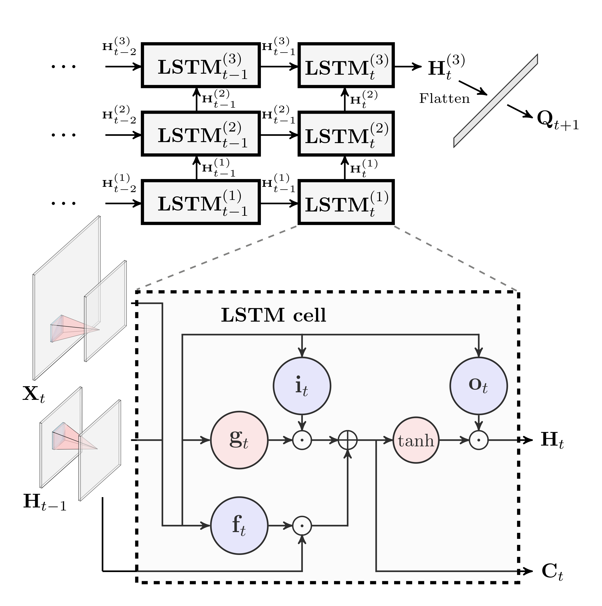

# UEB_ConvLSTM

Source codes for streamflow simulation using integrated UEB and ConvLSTM model.

MxNet, an open-source deep learning software framework, is used to implement and train deep neural networks.

Related research article: **Hybrid physically-based and deep learning modeling of a snow dominated mountainous karst watershed**

Citation:

Xu, T., Longyang, Q., Tyson, C., Zeng, R., Neilson, B.T. Hybrid physically-based and deep learning modeling of a snow dominated mountainous karst watershed. Under Review.
